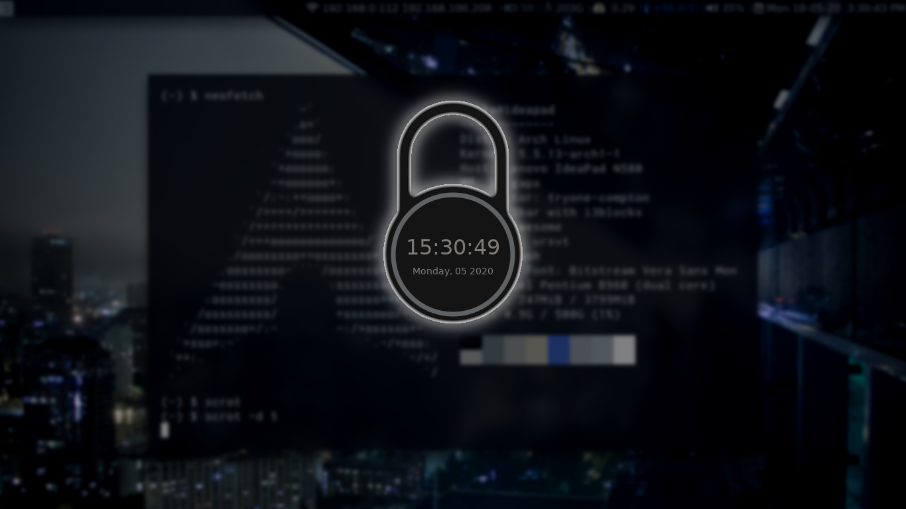

# Discape's Arch Linux rice (prolly works on other systems too)

Win+W opens up a rofi menu that lists all the wallpapers. When selected, pywal generates colorschemes for the terminal(urxvt), bar(i3bar), and lockscreen(i3lock)

Win+Shift+W resets wallpaper and colors.

Win+HJKL selects the window to the Left/Down/Up/Right

Win+Shift+Q closes the window

Win+1/2/3/4... switches workspaces

Win+Shift+1/2/3/4... moves the window to another workspace

Win+Shift+R reloads i3

Win+Shift+E asks if you want to exit i3

